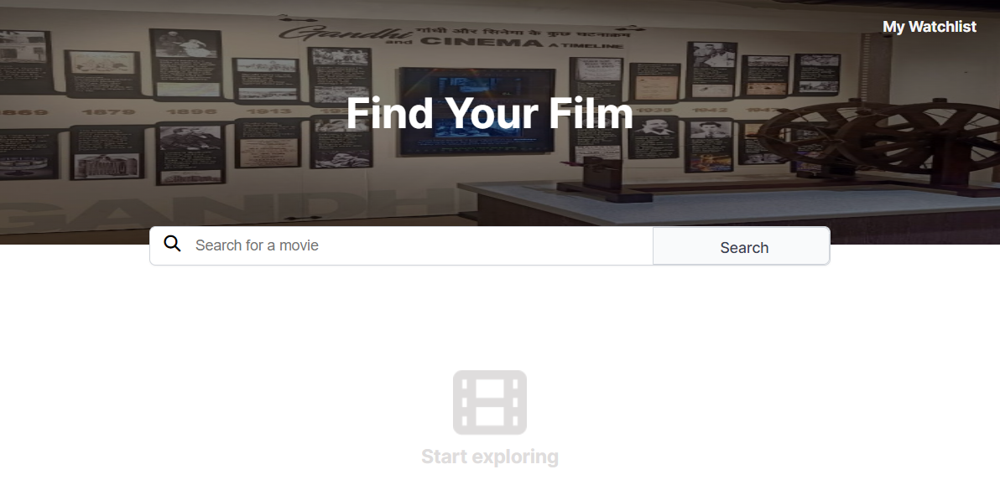

# Movie WatchList :

- This is a solo project from [Scrimba](https://scrimba.com/learn/frontend).

## About :

- This solo project used [OMDb](https://www.omdbapi.com/) API to fetch movie data as requested by user. 
- This is a responsive web page which allows user to search movies, get sneak-peak info about that movie. 
- User can maintain a watch later list to save their favourite movie for later.   

## Project screenshots :  

   
  
  
