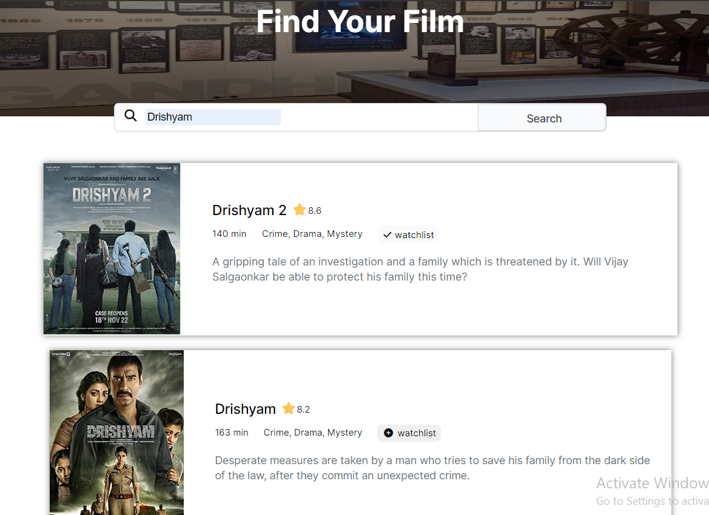

# Movie WatchList :

- This is a solo project from [Scrimba](https://scrimba.com/learn/frontend).

## About :

- This solo project uses [OMDb](https://www.omdbapi.com/) API to fetch movie data as requested by user. 
- This is a responsive web page which allows user to search movies, get sneak-peak info about that movie. 
- User can maintain a watch later list to save their favourite movie in local storage for later.   

## Project screenshots :  

1. Home Page :   

  

2. Search a movie :   

  

3. Add movie to watchlist :   

  

4. My Watchlist Page :   

  

<h3>Project is delpoyed here - <a href="https://gleeful-dango-9e60f5.netlify.app/" target="_blank">MovieWatchlist</a>
</h3>
